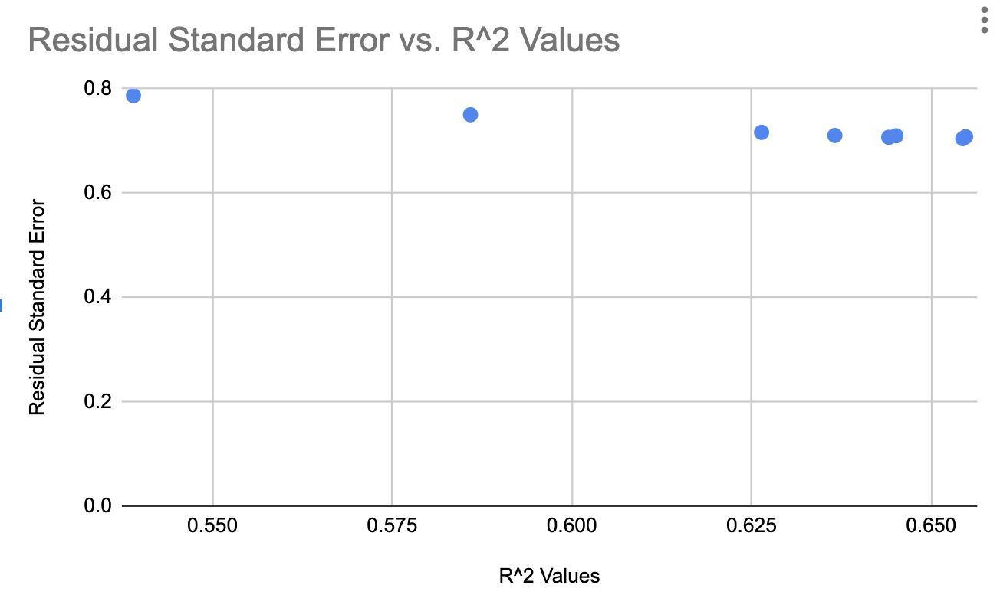

### Problem 1.1:
The dataset teengamb concerns a study of teenage gambling in Britain. Make a
numerical and graphical summary of the data, commenting on any features that you
find interesting. Limit the output you present to a quantity that a busy reader would
find sufficient to get a basic understanding of the data.

### Answer 1.1:
We can complete the numerical summary with the following R-code.
```{r teengamb}
library(faraway)
summary(teengamb)
pairs(teengamb)
plot(teengamb$verbal, teengamb$status)
plot(teengamb$income, teengamb$gamble)
plot(teengamb$status, teengamb$gamble)
```
Now, looking at our graphs, we can note that there seems to be a positive linear relationship between
the individuals socioeconomic status score and their verbal verbal word score. Similarly, there
appears to be a positive relationship between the income that an individual has and their expenditure on 
gambling in pounds per year as indicated by the plot. However it is interesting to note that there does not seem to be a relationship between the socioeconomic status of an individual and their expenditure on gambling in pounds per year. We can note that in our study, our values for the 
pounds per week income of individuals ranged from (what seems to be) 600 pounds to 15,000 pounds per week.

### Problem 1.3
The dataset prostate is from a study on 97 men with prostate cancer who were due to receive
a radical prostatectomy. Make a numerical and graphical summary of the data as in the first
question.

### Answer 1.3
Once again, we can construct a numerical and graphical summary of the data using the following R-code.
```{r prostate}
library(faraway)
summary(prostate)
pairs(prostate)
plot(prostate$lcavol, prostate$lpsa)
plot(prostate$lweight, prostate$lcavol)
```
Evaluating our summaries, we can see that there appears to be a positive linear relationship between the log of prostate specific antigens and the log of the cancer volume, indicating some possible relationship between the amount of these prostate specific antigens and the volume of cancer in the prostate. There could also be a relationship between the log of the weight of an individual and the log of the cancer volume, though it is notable that there exists a point of high influence that is well outside of the spread of the rest of values.

### Problem 1.4
The dataset sat comes from a study entitled “Getting What You Pay For: The Debate Over Equity in Public School Expenditures.” Make a numerical and graphical summary of the data as in the first question.

### Answer 1.4
```{r sat}
library(faraway)
summary(sat)
pairs(sat)
plot(sat$expend, sat$salary)
plot(sat$ratio, sat$math)
```
Evaluating our data, we can note that there is a positive linear relationship between the expendature per student in daily average attendance and the estimated salary of the teachers, which makes sense as if the school is spending more per student, part of that is spent on the teachers. Similarly, it is noteworthy that the relation between the average verbal SAT scores and the average math SAT scores is almost perfectly linear, which makes sense as if an individual scores well in one category, they could likely score well in the other. Surprisingly, there does not seem to be a significant relationship between the average math SAT scores and the average pupil/teacher ratio in public elementary and secondary schools, which I would expect to be related, as a hallmark of quality instruction seems to be a reduced student to teacher ratio and higher SAT scores.

### Problem 2.1
The dataset teengamb concerns a study of teenage gambling in Britain. Fit a regression model with the expenditure on gambling as the response and the sex, status, income and verbal score as predictors. Present the output.
  1. What percentage of variation in the response is explained by these predictors?
  2. Which observation has the largest (positive) residual? Give the case number.
  3. Compute the mean and median of the residuals.
  4. Compute the correlation of the residuals with the fitted values.
  5. Compute the correlation of the residuals with the income.
  6. For all other predictors held constant, what would be the difference in predicted
expenditure on gambling for a male compared to a female?

### Answer 2.1
  First, we can construct our linear regression model with the following R-code,
```{r linear regression}
    library(faraway)
    reg <- lm(gamble ~ sex + status + income + verbal, data = teengamb)
    summary(reg)
   cor(fitted(reg), residuals(reg))
```
  1) We can see from our summary that the $R^2$ indicates that 53.7% of the variation is explained by the predicators.
  2) The case that has the largest positive residual is row 24 in our data frame.
  3) Using R, we can see that the mean of the residual is -3.065293e-17 and that the median is -1.451392.
  4) Using R, we can calculate that the correlation of the residuals with the fitted values is -1.070659e-16.
  5) Using R, we can calculate that the correlation of the residuals with the income is 0.857142.
  6) For all other predictors held constant, the difference in predicted expenditure on gambling for a female
  compared to a male would be 22.12 dollars less.

### Problem 2.4
The dataset prostate comes from a study on 97 men with prostate cancer who were due to receive a radical prostatectomy. Fit a model with lpsa as the response and lcavol as
the predictor. Record the residual standard error and the $R^2$. Now add lweight, svi, lbph, age, lcp, pgg45 and gleason to the model one at a time. For each model record
the residual standard error and the $R^2$. Plot the trends in these two statistics.

### Answer 2.4
For the sake of ease, we will first constuct a list where we record the different residual values
and $R^2$ values for each additional and then attatch said plot at the end.
```{R prostate regression}
library(faraway)
#summary(prostate)
reg <- lm(lpsa ~ lcavol + lweight + svi + lbph + age + lcp + pgg45+ gleason, data = prostate)
    summary(reg)
```
1) lcavol: $R^2 = 0.5394$, residual standard error: 0.7875
2) lcavol + lweight: $R^2 = 0.5859$, residual standard error: 0.7506
3) lcavol + lweight + svi: $R^2 =  0.6264$, residual standard error:  0.7168
4) lcavol + lweight + svi + lbph: $R^2 =   0.6366$, residual standard error: 0.7108
5) lcavol + lweight + svi + lbph + age: $R^2 = 0.6441$, residual standard error: 0.7073
6) lcavol + lweight + svi + lbph + age + lcp:$R^2 = 0.6451$, residual standard error: 0.7102
7) lcavol + lweight + svi + lbph + age + lcp + pgg45:$R^2 = 0.6544$, residual standard error: 0.7048
lcavol + lweight + svi + lbph + age + lcp + pgg45 + gleason:$R^2 = 0.6548$, residual standard error: 0.7084
Now, we can construct the following plot of the two statistics as follows,

Looking at our plot, we can see that as our $R^2$ increases, there is a reduction in the Residual Standard Error.


